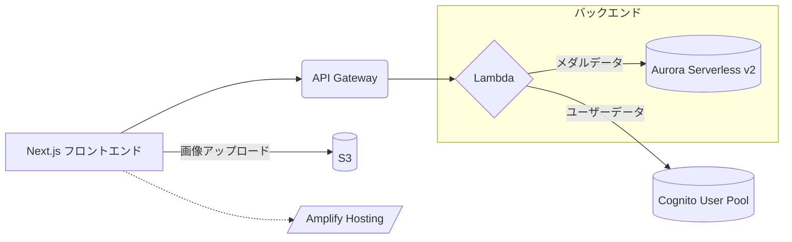

### スーベニアメダル管理サービス AWS構成
#### 概要

このドキュメントは、個人で開発するスーベニアメダル管理サービスのためのAWS構成を記述します。サーバーレスアーキテクチャを採用し、LambdaとAurora Serverless v2を活用することで、運用コストの削減とスケーラビリティの向上を図ります。

#### アーキテクチャ図

#### コンポーネント

| コンポーネント | 説明 |
|---|---|
| Next.js フロントエンド | ユーザーインターフェースを提供するフロントエンドアプリケーション。Amplify Librariesを使用して、認証、APIアクセス、ストレージなどの機能を統合します。 |
| Amplify Hosting | Next.jsフロントエンドをホスティングし、CI/CDパイプラインを提供します。 |
| API Gateway | APIエンドポイントを作成し、Lambda関数へのリクエストをルーティングします。認証、認可、トラフィック管理などの機能を提供します。 |
| Lambda | APIリクエストを処理するサーバーレス関数を実行します。Go言語でバックエンドロジックを実装し、データベースとのやり取りを行います。 |
| Aurora Serverless v2 | MySQL互換のリレーショナルデータベースサービス。サーバーレスであるため、使用状況に応じて自動的にスケールし、コスト効率に優れています。 |
| Cognito User Pool | ユーザー登録、ログイン、パスワード管理などの認証機能を提供します。 |
| S3 | メダルの画像やユーザーのプロフィール画像などを保存します。 |
| Route 53 | カスタムドメイン名を管理し、フロントエンドやAPIエンドポイントに紐付けます。 |
| ACM | SSL/TLS証明書をプロビジョニングし、HTTPS通信を有効にします。 |
| CloudWatch | ログ収集、メトリクス監視、アラーム設定を行い、アプリケーションの運用をサポートします。 |
| Secrets Manager | RDSの認証情報などを安全に管理します。 |

#### データモデル

ER図で定義されたデータモデルに基づいて、Aurora Serverless v2にテーブルを作成します。

#### セキュリティ

* IAMロール、セキュリティグループ、WAFなどを適切に設定し、セキュリティを確保します。
* Cognito User Poolを使用して、セキュアなユーザー認証を実現します。
* Secrets Managerを使用して、データベース認証情報などを安全に管理します。

#### CI/CD

* Amplify HostingのCI/CD機能を使用して、コードの変更を自動的にデプロイします。

#### 運用

* CloudWatchを使用して、アプリケーションのログを監視し、メトリクスを収集します。
* 必要に応じて、アラームを設定し、問題発生時に通知を受け取ります。

#### コスト

* Lambda、Aurora Serverless v2、S3などのサービスは、使用量に応じた従量課金制です。
* AWS Cost Explorerなどを活用し、コストを定期的に監視し、最適化します。

#### 今後の拡張

* 必要に応じて、他のAWSサービス（例：Elasticache for Redis、SQS、SNSなど）を追加することができます。
* 機械学習サービス（例：Amazon Rekognition）を導入し、画像認識によるメダル情報の自動入力などを実現することができます。

#### 備考

* このドキュメントは、現時点での想定に基づいて作成されています。
* 必要に応じて、内容を更新していく必要があります。

#### 参考資料

* [AWS Amplify](https://aws.amazon.com/jp/amplify/)
* [AWS Lambda](https://aws.amazon.com/jp/lambda/)
* [Amazon Aurora Serverless v2](https://aws.amazon.com/jp/rds/aurora/serverless/)
* [Amazon Cognito](https://aws.amazon.com/jp/cognito/)
* [Amazon S3](https://aws.amazon.com/jp/s3/)