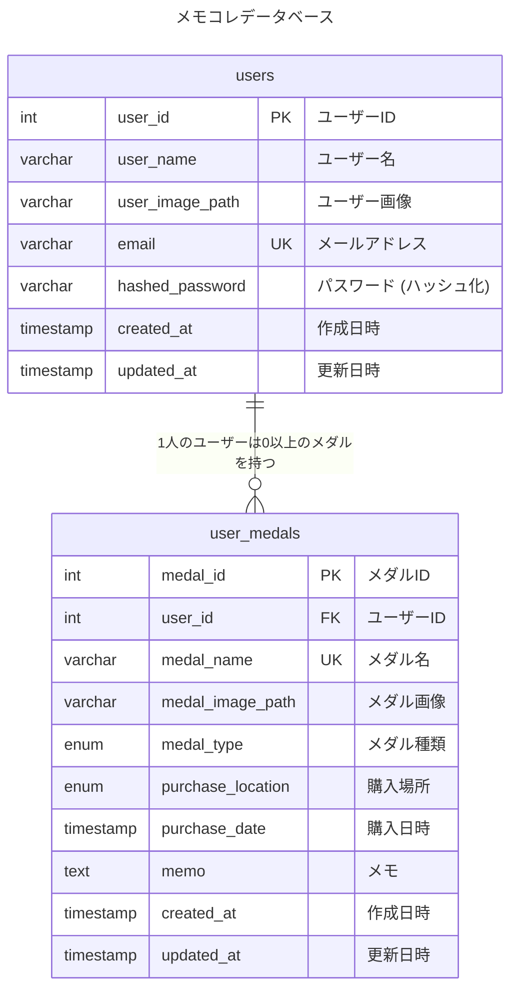

# ER図

```mermaid
---
title: "メモコレデータベース"
---
erDiagram
    users ||--o{ user_medals: "1人のユーザーは0以上のメダルを持つ"

  users {
    int user_id PK "ユーザーID"
    varchar user_name "ユーザー名"
    varchar user_image_path "ユーザー画像"
    varchar email UK "メールアドレス"
    varchar hashed_password "パスワード (ハッシュ化)"
    timestamp created_at "作成日時"
    timestamp updated_at "更新日時"
  }

  user_medals {
    int medal_id PK "メダルID"
    int user_id FK "ユーザーID"
    varchar medal_name UK "メダル名"
    varchar medal_image_path "メダル画像"
    enum medal_type "メダル種類"
    enum purchase_location "購入場所"
    timestamp purchase_date "購入日時"
    text memo "メモ"
    timestamp created_at "作成日時"
    timestamp updated_at "更新日時"
  }
```