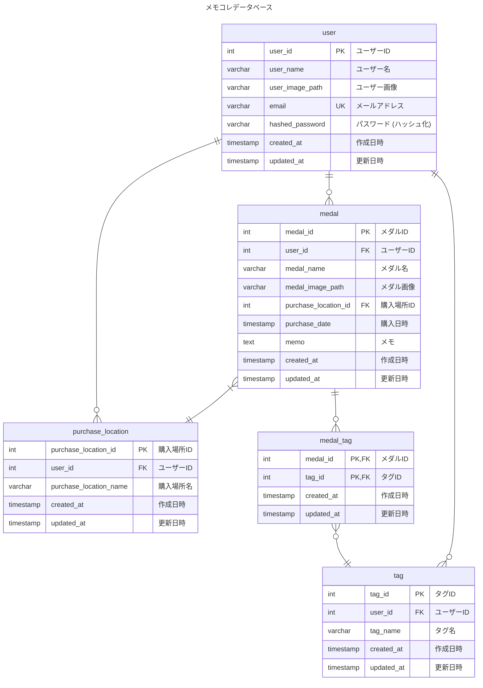

# ER図

```mermaid
---
title: "メモコレデータベース"
---
erDiagram
    user ||--o{ medal: ""
    user ||--o{ tag: ""
    medal }|--|| purchase_location: ""
    medal ||--o{ medal_tag: ""
    user ||--o{ purchase_location: ""
    medal_tag }o--|| tag: ""

  user {
    int user_id PK "ユーザーID"
    varchar user_name "ユーザー名"
    varchar user_image_path "ユーザー画像"
    varchar email UK "メールアドレス"
    varchar hashed_password "パスワード (ハッシュ化)"
    timestamp created_at "作成日時"
    timestamp updated_at "更新日時"
  }

  medal {
    int medal_id PK "メダルID"
    int user_id FK "ユーザーID"
    varchar medal_name "メダル名"
    varchar medal_image_path "メダル画像"
    int purchase_location_id FK "購入場所ID"
    timestamp purchase_date "購入日時"
    text memo "メモ"
    timestamp created_at "作成日時"
    timestamp updated_at "更新日時"
  }

  medal_tag {
    int medal_id PK,FK "メダルID"
    int tag_id PK,FK "タグID"
    timestamp created_at "作成日時"
    timestamp updated_at "更新日時"
  }

  tag {
    int tag_id PK "タグID"
    int user_id FK "ユーザーID"
    varchar tag_name "タグ名"
    timestamp created_at "作成日時"
    timestamp updated_at "更新日時"
  }

  purchase_location {
    int purchase_location_id PK "購入場所ID"
    int user_id FK "ユーザーID"
    varchar purchase_location_name "購入場所名"
    timestamp created_at "作成日時"
    timestamp updated_at "更新日時"
  }
```